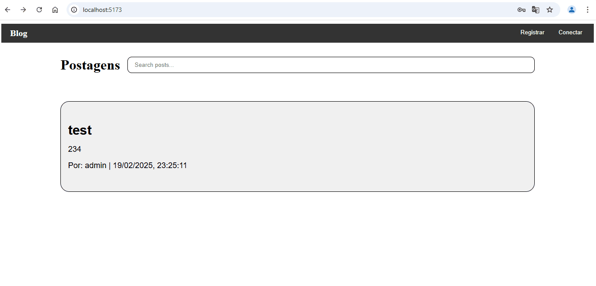

# Blog API & Frontend (Flask + Vue.js + PostgreSQL)
Este é um projeto de blog que utiliza Flask como backend, Vue.js como frontend e PostgreSQL como banco de dados. Ele permite a criação de postagens, comentários, login com JWT e um sistema de privilégios para administradores.

## Funcionalidades
Autenticação JWT: Cadastro e login de usuários com autenticação segura via JWT.
Postagens: Criar, editar e remover postagens no blog.
Comentários: Adicionar e deletar comentários em postagens.
Moderação: Administradores podem editar ou remover qualquer postagem e comentário.
Sistema de Privilégios: Apenas usuários autorizados podem moderar o blog.

## Tecnologias Utilizadas
Backend: Flask + Flask-JWT + SQLAlchemy
Frontend: Vue.js + Vue Router + Axios
Banco de Dados: PostgreSQL
Autenticação: JWT (JSON Web Token)

## Como Rodar o Projeto
### Configurando o Backend (Flask)
Clone o repositório:
git clone https://github.com/seu-usuario/seu-repositorio.git
cd seu-repositorio/backend
configurar o config.py com as suas informações

Execute o servidor backend:
python app.py

### Configurando o Frontend (Vue.js)
cd ../frontend

Instale as dependências:
npm install

Execute o servidor de desenvolvimento:
npm run dev

## Endpoints da API
Método	Rota	Descrição	Autenticação

POST	/auth/register	Cadastro de usuários	❌

POST	/auth/login	Login e retorno do token JWT	❌

GET	/posts	Lista todas as postagens	❌

POST	/posts	Cria uma nova postagem	✅

PUT	/posts/{id}	Edita uma postagem	✅ (Dono/Admin)

DELETE	/posts/{id}	Deleta uma postagem	✅ (Dono/Admin)

GET	/posts/{id}/comments	Lista comentários de uma postagem	❌

POST	/comments	Adiciona um comentário	✅

DELETE	/comments/{id}	Remove um comentário	✅ (Dono/Admin)

## Controle de Acesso
Usuários comuns podem criar postagens, editar/deletar apenas suas próprias postagens/comentários.
Administradores podem editar/deletar qualquer postagem ou comentário.
Os admnistradores são definidos somente no banco de dados postgresql 

## Licença
Este projeto está sob a licença MIT. Veja o arquivo LICENSE para mais detalhes.

Se precisar de ajustes ou quiser adicionar mais informações, me avise! 🚀
